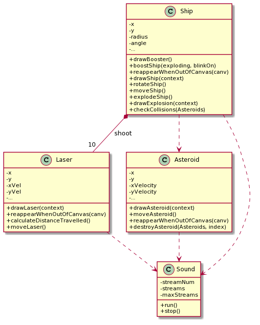
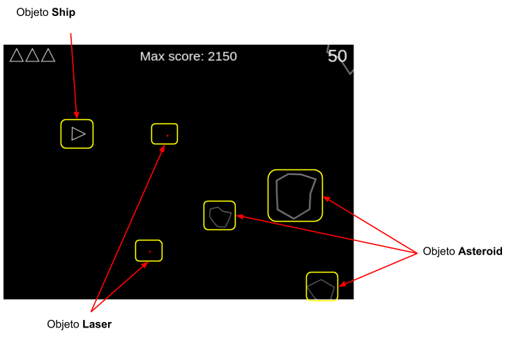
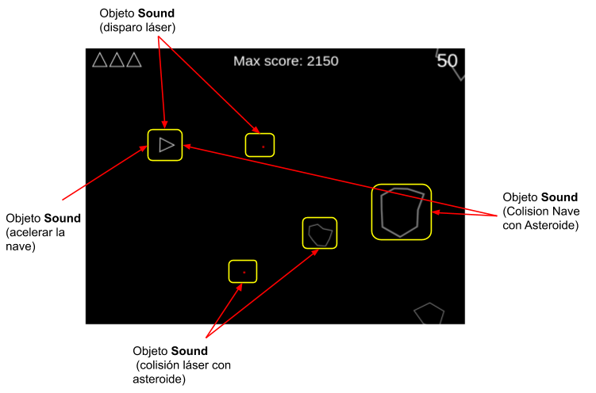

# **Asteroids** (Documentación)

## Índice

1. [UML](#UML)
2. [Diseño](#Diseño)
   1. [Objetos Ship, Asteroid, Laser](#Objetos-Ship,-Asteroid,-Laser)
   2. [Objetos Sound](#Objetos-Sound)

## UML

	

## Diseño
Para una mejor visualización se ha separado los objetos Sound en una imagen.

### Objetos Ship, Asteroid, Laser
Mostramos gráficamente los objetos de cada clase.

	

### Objetos Sound
Pantalla inicial al iniciar el juego, empezamos en el nivel 1, a medida que destruyamos los asteroides el nivel se va incrementando

	

